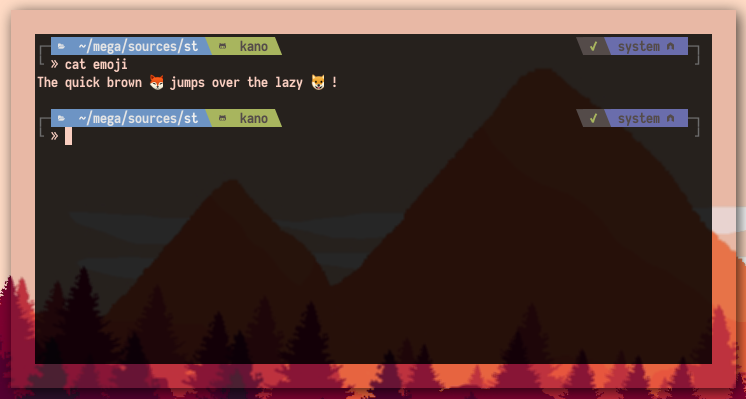

# st - simple terminal

**st** is a simple terminal emulator for X which sucks less.

## Requirements

In order to build st you need the Xlib header files.

> **Note:**
> [This branch](https://gitlab.freedesktop.org/mawww/libxft/tree/bgra-glyphs) of libXft was used to avoid st from crashing with emoji.

## Installation

st is installed into the `/usr/local` namespace by default(if necessary as root):

    make -j clean install

You can change it by setting `PREFIX` (for example, install at `~/.local`):

    make PREFIX=~/.local -j clean install

## Running st

If you did not install st with `make clean install`, you must compile
the st terminfo entry with the following command:

    tic -sx st.info

See the man page for additional details.

## Credits

Based on Aurélien APTEL <aurelien dot aptel at gmail dot com> bt source code.

## Pathced with

- \[ [Alapha Focus Highlight](https://st.suckless.org/patches/alpha_focus_highlight/) \]:
  [st-alphaFocusHighlight-20191107-2b8333f.diff](https://github.com/juliusHuelsmann/st/releases/download/patchesV1/st-alphaFocusHighlight-20191107-2b8333f.diff)

- \[ [anysize](https://st.suckless.org/patches/anysize/) \]:
  [st-anysize-0.8.1.diff](https://st.suckless.org/patches/anysize/st-anysize-0.8.1.diff)

- \[ [boxdraw](https://st.suckless.org/patches/boxdraw/) \]:
  [st-boxdraw_v2-0.8.2.diff](https://st.suckless.org/patches/boxdraw/st-boxdraw_v2-0.8.2.diff)

- \[ [desktopentry](https://st.suckless.org/patches/desktopentry/) \]:
  [st-desktopentry-0.8.2.diff](https://st.suckless.org/patches/desktopentry/st-desktopentry-0.8.2.diff)

- \[ [copyurl](https://st.suckless.org/patches/copyurl/) + [open_copied_url](https://st.suckless.org/patches/open_copied_url/) \]:
  - [st-copyurl-20190202-3be4cf1.diff](https://st.suckless.org/patches/copyurl/st-copyurl-20190202-3be4cf1.diff)
  - [st-openclipboard-20190202-3be4cf1.diff](https://st.suckless.org/patches/open_copied_url/st-openclipboard-20190202-3be4cf1.diff)

- \[ [A simpler plumb patch](https://st.suckless.org/patches/right_click_to_plumb/) \]:
  [plumb_without_shell_OSC.diff](https://st.suckless.org/patches/right_click_to_plumb/plumb_without_shell_OSC.diff)

- \[ [scrollback](https://st.suckless.org/patches/scrollback/) \]:
  
  - scrolling using Shift+\{PageUp, PageDown\}:
    [st-scrollback-20190331-21367a0.diff](https://st.suckless.org/patches/scrollback/st-scrollback-20190331-21367a0.diff)
  - scrolling using Shift+MouseWheel:
    [st-scrollback-mouse-20191024-a2c479c.diff](https://st.suckless.org/patches/scrollback/st-scrollback-mouse-20191024-a2c479c.diff)
  - scrollback using mouse wheel only when not in MODE_ALTSCREEN:
    [st-scrollback-mouse-altscreen-20191024-a2c479c.diff](https://st.suckless.org/patches/scrollback/st-scrollback-mouse-altscreen-20191024-a2c479c.diff)
  - changing scrolling speed:
    [st-scrollback-mouse-increment-0.8.2.diff](https://st.suckless.org/patches/scrollback/st-scrollback-mouse-increment-0.8.2.diff)

- \[ [New terminal in current directory](https://st.suckless.org/patches/newterm/) \]:
  [st-newterm-0.8.2.diff](https://st.suckless.org/patches/newterm/st-newterm-0.8.2.diff)

- \[ [spoiler](https://st.suckless.org/patches/spoiler/) \]:
  [st-spoiler-20180309-c5ba9c0.diff](https://st.suckless.org/patches/spoiler/st-spoiler-20180309-c5ba9c0.diff)

- \[ [vertcenter](https://st.suckless.org/patches/vertcenter/) \]:
  [st-vertcenter-20180320-6ac8c8a.diff](https://st.suckless.org/patches/vertcenter/st-vertcenter-20180320-6ac8c8a.diff)

- \[ [Visual bell 2](https://st.suckless.org/patches/visualbell/) \]:
  [st-visualbell2-enhanced-2018-10-16-30ec9a3.diff](https://st.suckless.org/patches/visualbell/st-visualbell2-enhanced-2018-10-16-30ec9a3.diff)

- \[ [xresources](https://st.suckless.org/patches/xresources/) \]:
  [st-xresources-20190105-3be4cf1.diff](https://st.suckless.org/patches/xresources/st-xresources-20190105-3be4cf1.diff)

  > Note: [color_schemes](https://st.suckless.org/patches/palettes/) conflicts with xresources.

- \[ [font2](https://st.suckless.org/patches/font2/) \]:
  [st-font2-20190416-ba72400.diff](https://st.suckless.org/patches/font2/st-font2-20190416-ba72400.diff)

- \[ [one clipboard](https://st.suckless.org/patches/clipboard/) \]:
  [st-clipboard-20180309-c5ba9c0.diff](https://st.suckless.org/patches/clipboard/st-clipboard-20180309-c5ba9c0.diff)
